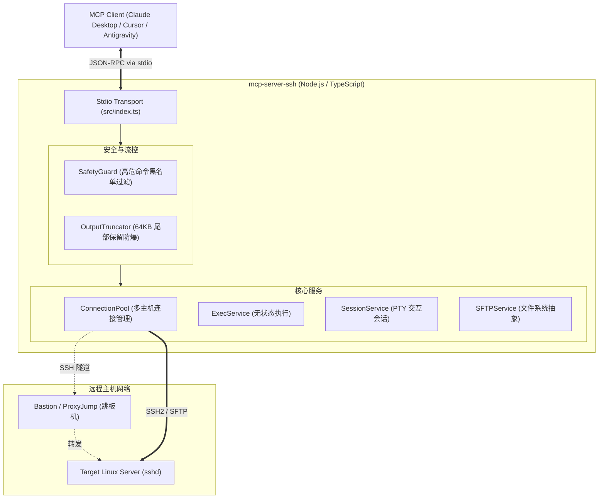

# mcp-server-ssh

[](./LICENSE)
[](https://nodejs.org/)
[](https://www.typescriptlang.org/)
[](https://modelcontextprotocol.io/)

基于 **OpenSSH 协议** 深度连接与操控 Linux/Unix 系统的 **Model Context Protocol (MCP)** 服务。为大语言模型（LLM）和自动化智能体（AI Agent）提供安全、可控、无侵入的远程执行与文件管理基础设施。

---

## 🌟 核心特性

- **🌐 零侵入 SSH 协议直连**：远程 Linux 主机仅需标准 OpenSSH Server，无需部署任何私有 Agent 或守护进程。
- **🔑 工业级认证链 & 跳板机**：完整支持本地公私钥（`id_ed25519` / `id_rsa`）、SSH-Agent 凭证探测、账密认证以及企业级 `ProxyJump` 堡垒机/跳板机隧道。
- **⚡ 双模命令执行引擎**：
  - **无状态执行 (`ssh_exec`)**：单次独立执行，环境相互隔离，精准捕获标准输出、标准错误与命令退出码（Exit Code）。
  - **交互式会话 (`ssh_session_*`)**：基于 PTY 伪终端维持持久会话，支持连续状态交互与中断信号（如 `\x03` Ctrl+C）。
- **📁 全功能 POSIX SFTP 管理**：覆盖远程文本快速读写（内置防 OOM 阈值）、大文件上传/下载、目录树浏览、属性查看（stat）、递归建删与权限变更（chmod）。
- **🛡️ 严格安全防御矩阵 (SafetyGuard)**：前置规则引擎实时扫描输入命令，精准阻断根目录强删（`rm -rf /`）、底层磁盘覆写（`dd` / `mkfs`）、系统关机重启（`reboot` / `shutdown`）及 Fork 炸弹等致命操作。
- **🎯 智能防爆截断 (OutputTruncator)**：对高吞吐日志输出实施 64KB 智能保护，保留前置 8KB 标头与后置 56KB 最新日志/堆栈，杜绝撑爆 LLM 上下文窗口。
- **🔌 动态连接池 & 开箱即用**：支持环境变量预载启动秒连默认主机，同时允许在运行时动态连接、切换和管理多台 Linux 主机。

---

## 🛠️ MCP 工具矩阵

### 1. 主机与连接管理 (`Connection`)
| 工具名称 | 功能描述 | 核心入参说明 |
| :--- | :--- | :--- |
| `ssh_connect` | 建立新 SSH 连接或按别名载入 | `host`, `port`, `username`, `password`, `privateKey`, `sshConfigAlias`, `proxyJump` |
| `ssh_disconnect` | 关闭指定的 SSH 连接 | `connectionId` |
| `ssh_list_connections` | 列出当前所有活跃连接与默认主机 | 无 |
| `ssh_list_config_hosts` | 读取本机 `~/.ssh/config` 预设别名 | 无 |

### 2. 命令执行与终端 (`Execution`)
| 工具名称 | 功能描述 | 核心入参说明 |
| :--- | :--- | :--- |
| `ssh_exec` | 无状态执行远程命令（主力工具） | `command`, `connectionId?`, `cwd?`, `timeoutMs?`, `dryRun?` |
| `ssh_session_start` | 启动交互式 PTY 伪终端会话 | `connectionId?`, `cols?`, `rows?` |
| `ssh_session_send` | 向持久终端写入指令或控制字符 | `sessionId`, `input`, `waitForMs?` |
| `ssh_session_close` | 关闭指定的交互终端会话 | `sessionId` |

### 3. SFTP 文件系统管理 (`Filesystem`)
| 工具名称 | 功能描述 | 核心入参说明 |
| :--- | :--- | :--- |
| `sftp_read_file` | 读取远程文本文件（限制最大字节） | `remotePath`, `connectionId?`, `maxBytes?` |
| `sftp_write_file` | 写入或覆盖远程文件内容 | `remotePath`, `content`, `createDirectories?` |
| `sftp_list_dir` | 列出远程目录文件与属性元数据 | `remotePath`, `connectionId?` |
| `sftp_stat` | 获取文件或目录的详细 POSIX 属性 | `remotePath`, `connectionId?` |
| `sftp_mkdir` | 创建远程目录（支持递归创建） | `remotePath`, `recursive?` |
| `sftp_remove` | 删除远程文件或目录（支持递归删除）| `remotePath`, `recursive?` |
| `sftp_upload` | 将本地文件上传到远程路径 | `localPath`, `remotePath` |
| `sftp_download` | 将远程文件下载到本地路径 | `remotePath`, `localPath` |

---

## ⚙️ 快速接入配置

在您的 MCP 宿主环境（如 Claude Desktop、Cursor 或 Antigravity）配置文件中增加如下配置：

### 方式 A：环境变量开箱即用（推荐）
```json
{
  "mcpServers": {
    "ssh": {
      "command": "node",
      "args": ["<path-to-repo>/dist/index.js"],
      "env": {
        "SSH_HOST": "192.168.1.100",
        "SSH_PORT": "22",
        "SSH_USER": "root",
        "SSH_KEY_PATH": "~/.ssh/id_ed25519"
      }
    }
  }
}
```

### 方式 B：指定本地 SSH 配置别名
```json
{
  "mcpServers": {
    "ssh": {
      "command": "node",
      "args": ["<path-to-repo>/dist/index.js"],
      "env": {
        "SSH_CONFIG_ALIAS": "prod-server"
      }
    }
  }
}
```

---

## 🏗️ 架构拓扑



---

## 📄 开源许可证

本项目遵循 [MIT License](./LICENSE) 协议开源。
