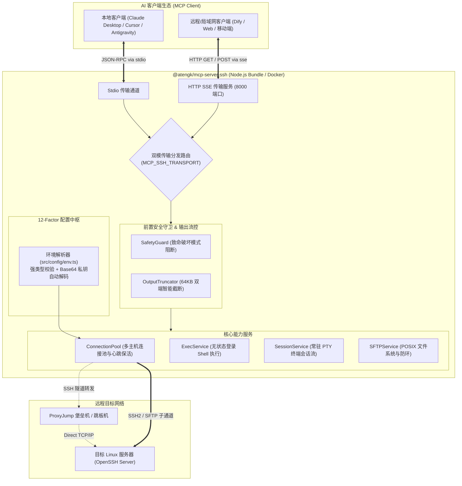

# @atengk/mcp-server-ssh

[](https://www.npmjs.com/package/@atengk/mcp-server-ssh)
[](https://github.com/atengk/mcp-server-ssh/releases)
[](https://github.com/atengk/mcp-server-ssh/actions/workflows/ci.yml)
[](./LICENSE)
[](./CONTRIBUTING.md)
[](https://nodejs.org/)
[](https://www.typescriptlang.org/)
[](https://modelcontextprotocol.io/)
[](./src)

基于标准 **OpenSSH 协议** 深度连接与操控 Linux/Unix 系统的 **Model Context Protocol (MCP)** 服务。为大语言模型（LLM）和 AI 智能体（Claude Desktop、Cursor、Antigravity、Cline 等）提供安全、可控、零侵入的远程终端执行与 POSIX 文件系统管理基础设施。

> 💡 **版本更新日志 (Release Notes)**：每一个正式版本的详细变动明细、修复记录与贡献者致谢均由系统自动维护，可直接前往 [GitHub Releases](https://github.com/atengk/mcp-server-ssh/releases) 查看最新记录。

---

## 🌟 核心特性 (Features)

- **🌐 零侵入标准协议直连**：目标 Linux 主机仅需原生 OpenSSH 服务，绝不安装任何专有 Agent 或 HTTP 守护进程（[ADR-0001](docs/adr/0001-direct-openssh-protocol.md)）。
- **⚡ 双模命令执行引擎**（[ADR-0002](docs/adr/0002-dual-execution-modes.md)）：
  - **无状态执行 (`ssh_exec`)**：单命令独立通道，默认包装为登录 Shell（`bash -l -c`）以完整继承用户环境变量与 `PATH`，精确捕获退出码、耗时与标准输出/错误。
  - **交互式会话 (`ssh_session_*`)**：基于 PTY 伪终端维持常驻会话流，支持流式增量回显与 `\x03` (Ctrl+C) 中断控制信号。
- **📁 全功能 POSIX SFTP 管理**：文本安全读写（内置 512KB 防撑爆阈值）、双向文件极速上传与下载、目录树浏览、POSIX 元数据获取、目录递归建删与软链接防环保护（`maxDepth: 10`）。
- **🔑 工业级凭证链与企业网络**：完整支持本地公私钥（`id_ed25519` / `id_rsa`）、SSH-Agent 探测、密码认证、`~/.ssh/config` 配置继承以及企业级 `ProxyJump` 堡垒机/跳板机隧道。
- **🛡️ 严格安全防护双保险**（[ADR-0003](docs/adr/0003-safety-guard-and-output-truncation.md)）：
  - **前置安全守卫 (`SafetyGuard`)**：实时拦截全盘强删（`rm -rf /`）、磁盘覆写（`dd`/`mkfs`）、关机重启（`reboot`/`shutdown`）及 Fork 炸弹等致命破坏，支持 `dryRun` 演练。
  - **智能防爆截断 (`OutputTruncator`)**：单次输出实施 64KB 双端智能截断（保留前 8KB 标头与后 56KB 最新日志），自动清洗 ANSI 终端转义符，保护 LLM 上下文不崩溃。
- **📦 免安装一键即用**：打包为独立单文件 Bundle，全球用户通过 `npx` 零依赖即开即用（[ADR-0004](docs/adr/0004-distribution-and-registry-strategy.md)）。

---

## 🚀 快速上手 (Quick Start)

无需 git clone 或本地编译，在任何支持 MCP 的宿主客户端配置文件（如 Claude Desktop 的 `claude_desktop_config.json`、Cursor 的 `mcp.json` 或 Antigravity / Cline 对应配置）中添加如下配置即可直接启动：

### 通用 MCP 客户端基础配置模板

```json
{
  "mcpServers": {
    "ssh": {
      "command": "npx",
      "args": ["-y", "@atengk/mcp-server-ssh"],
      "env": {
        "MCP_SSH_HOST": "192.168.1.100",
        "MCP_SSH_PORT": "22",
        "MCP_SSH_USER": "root",
        "MCP_SSH_KEY_PATH": "/Users/yourname/.ssh/id_ed25519"
      }
    }
  }
}
```
> 💡 **向后兼容提示**：服务已全面升级为规范的 `MCP_SSH_*` 专属命名空间，同时 100% 透明向下兼容遗留的 `SSH_*` 环境变量，老用户无需修改已有配置即可平滑升级。

---

## ⚙️ 5 大连接场景配置矩阵 (Scenarios)

针对不同网络拓扑与鉴权需求，提供开箱即用的配置范例：

### 场景 1：密码账密直连 (最简临时测试)
```json
{
  "mcpServers": {
    "ssh": {
      "command": "npx",
      "args": ["-y", "@atengk/mcp-server-ssh"],
      "env": {
        "MCP_SSH_HOST": "192.168.1.100",
        "MCP_SSH_PORT": "22",
        "MCP_SSH_USER": "root",
        "MCP_SSH_PASSWORD": "your_secure_password"
      }
    }
  }
}
```

### 场景 2：公私钥免密直连 (生产环境规范推荐)
支持物理文件路径、原始 PEM 文本与 Base64 编码三种形态：
```json
{
  "mcpServers": {
    "ssh": {
      "command": "npx",
      "args": ["-y", "@atengk/mcp-server-ssh"],
      "env": {
        "MCP_SSH_HOST": "192.168.1.100",
        "MCP_SSH_PORT": "22",
        "MCP_SSH_USER": "root",
        "MCP_SSH_KEY_PATH": "D:/files/server/id_ed25519",
        "MCP_SSH_KEY_PASSPHRASE": "optional_passphrase"
      }
    }
  }
}
```
> 💡 **免文件挂载小妙招**：在容器或无文件系统环境中，可直接将私钥 Base64 字符串赋值给 `MCP_SSH_PRIVATE_KEY_BASE64`（或 PEM 文本赋值给 `MCP_SSH_PRIVATE_KEY`），服务将自动解码，无需挂载任何本地私钥文件！  
> 💡 **Windows 提示**：本地路径强烈推荐统一使用正斜杠（如 `"D:/files/server/id_ed25519"`），Node.js 原生完美支持，且能彻底避免 JSON 反斜杠转义（`\\`）遗漏导致的解析崩溃。

### 场景 3：直接复用本地 `~/.ssh/config` 别名 (最推荐，省心免配)
直接继承本机既有的公私钥路径、跳板机、自定义端口与 Host 别名：
```json
{
  "mcpServers": {
    "ssh": {
      "command": "npx",
      "args": ["-y", "@atengk/mcp-server-ssh"],
      "env": {
        "MCP_SSH_CONFIG_ALIAS": "my-cloud-vps"
      }
    }
  }
}
```

### 场景 4：企业级 ProxyJump 堡垒机/跳板机隧道
通过公网跳板机（Bastion）安全穿透至隔离内网中的私有目标服务器：
```json
{
  "mcpServers": {
    "ssh": {
      "command": "npx",
      "args": ["-y", "@atengk/mcp-server-ssh"],
      "env": {
        "MCP_SSH_HOST": "10.0.1.50",
        "MCP_SSH_PORT": "22",
        "MCP_SSH_USER": "deploy",
        "MCP_SSH_PROXY_HOST": "bastion.company.com",
        "MCP_SSH_PROXY_PORT": "2222",
        "MCP_SSH_PROXY_USER": "bastion_user"
      }
    }
  }
}
```

### 场景 5：纯空载启动 (在会话中动态管理多主机)
启动时不配置任何环境变量，后续在对话中直接通过自然语言指示 AI 连接或切换不同的主机：
```json
{
  "mcpServers": {
    "ssh": {
      "command": "npx",
      "args": ["-y", "@atengk/mcp-server-ssh"]
    }
  }
}
```

---

## 🌐 环境变量完整速查矩阵 (12-Factor App)

全面遵循现代化 **12-Factor App** 规范，服务提供官方主前缀 `MCP_SSH_*` 规范变量与向下兼容变量双重支持：

| 分类 | 推荐主环境变量 | 宽容兼容变量 | 默认值 / 行为说明 |
| :--- | :--- | :--- | :--- |
| **传输协议** | `MCP_SSH_TRANSPORT` | `SSH_TRANSPORT` / `MCP_TRANSPORT` | `stdio`（本地单机）、`sse`（网络/容器常驻） |
| **服务监听地址**| `MCP_SSH_SERVER_HOST` | `SSH_SERVER_HOST` / `HOST` | SSE 模式监听地址，默认 `0.0.0.0` |
| **服务监听端口**| `MCP_SSH_SERVER_PORT` | `SSH_SERVER_PORT` / `PORT` | SSE 模式监听端口，默认 `8000` |
| **目标主机地址**| `MCP_SSH_HOST` | `SSH_HOST` | 目标 Linux 服务器 IP 或域名（提供时触发自动建连） |
| **目标主机端口**| `MCP_SSH_PORT` | `SSH_PORT` | 目标 SSH 端口号，默认 `22` (1~65535) |
| **认证用户名** | `MCP_SSH_USER` | `SSH_USER` / `SSH_USERNAME` | 登录用户名（缺省自动探测系统用户） |
| **认证密码** | `MCP_SSH_PASSWORD` | `SSH_PASSWORD` | 明文密码（日志与输出中强制掩码 `***` 脱敏） |
| **私钥文件路径**| `MCP_SSH_KEY_PATH` | `SSH_KEY_PATH` / `SSH_PRIVATE_KEY_PATH` | 本地私钥绝对或 `~` 家目录路径 |
| **私钥文本内容**| `MCP_SSH_PRIVATE_KEY` | `SSH_PRIVATE_KEY` | 原始 PEM 格式私钥文本（自动还原 `\n` 转义换行） |
| **Base64 私钥** | `MCP_SSH_PRIVATE_KEY_BASE64`| `SSH_PRIVATE_KEY_BASE64` | **Base64 编码私钥（彻底避免换行丢失，免文件挂载！）** |
| **私钥解密口令**| `MCP_SSH_KEY_PASSPHRASE`| `SSH_KEY_PASSPHRASE` | 若私钥受密码保护，提供解密口令 |
| **配置别名** | `MCP_SSH_CONFIG_ALIAS`| `SSH_CONFIG_ALIAS` | 继承本地 `~/.ssh/config` 中的 Host 别名 |
| **跳板机主机** | `MCP_SSH_PROXY_HOST` | `SSH_PROXY_HOST` | ProxyJump 堡垒机/跳板机 IP 或域名 |
| **跳板机端口** | `MCP_SSH_PROXY_PORT` | `SSH_PROXY_PORT` | 跳板机端口，默认 `22` |
| **跳板机用户** | `MCP_SSH_PROXY_USER` | `SSH_PROXY_USER` | 跳板机登录用户名 |
| **跳板机密码** | `MCP_SSH_PROXY_PASSWORD`| `SSH_PROXY_PASSWORD` | 跳板机认证密码（可选） |
| **跳板机私钥** | `MCP_SSH_PROXY_PRIVATE_KEY_BASE64`| `SSH_PROXY_PRIVATE_KEY` | 跳板机专用私钥文本或 Base64 编码（可选） |
| **跳板机私钥口令**| `MCP_SSH_PROXY_KEY_PASSPHRASE`| `SSH_PROXY_KEY_PASSPHRASE` | 跳板机私钥解密口令（可选） |
| **建连超时时间**| `MCP_SSH_TIMEOUT` | `SSH_TIMEOUT` | 目标建连超时时间（毫秒），默认 `30000` |
| **心跳保活间隔**| `MCP_SSH_KEEP_ALIVE_INTERVAL`| `SSH_KEEP_ALIVE_INTERVAL` | KeepAlive 心跳间隔（毫秒），默认 `10000` |
| **致命命令逃生门**| `MCP_SSH_ALLOW_DANGEROUS_COMMANDS`| `SSH_ALLOW_DANGEROUS_COMMANDS` | 宽容布尔值（`1`/`true`/`yes`），默认 `false` 严格阻断 |

> 📌 **解析优先级规则**：`MCP_SSH_* (官方标准前缀，最高)` > `SSH_* (向下兼容前缀)` > `系统内置默认推导`。本地执行时会自动探测读取同级目录下的 `.env` 文件。

---

## 🔌 远程服务调用 (SSE 协议客户端接入)

若服务已部署在局域网服务器、NAS（群晖/威联通）或云容器中，MCP 客户端可直接通过标准 HTTP SSE 端点网络接入，无需在客户端本地安装 Node.js 或运行子进程：

```json
{
  "mcpServers": {
    "ssh-remote": {
      "url": "http://192.168.1.100:8000/sse"
    }
  }
}
```

### 服务端点矩阵与健康检查探针

在 SSE 模式下，轻量 HTTP 服务对外暴露以下规范端点：

| 端点路由 | HTTP 方法 | 功能说明 | 响应格式 / 状态 |
| :--- | :--- | :--- | :--- |
| `/sse` | `GET` | 建立长轮询 Server-Sent Events 事件流，协商客户端 Session | `text/event-stream` |
| `/message` | `POST` | 客户端发送 JSON-RPC 消息请求（需携带 `?sessionId=...`） | `application/json` (202 Accepted) |
| `/health` | `GET` | 服务就绪与存活探针（支持 Docker/K8s 容器健康检查） | `application/json` (200 OK) |

探针请求回显范例：
```json
{
  "status": "ok",
  "service": "mcp-server-ssh",
  "version": "1.2.4",
  "timestamp": "2026-10-04T02:00:00.000Z"
}
```

---

## 🐳 生产环境容器化常驻部署 (Docker & Docker Compose)

项目已由 GitHub Actions CI/CD 自动构建并发布官方多架构镜像（全平台支持 `linux/amd64` 与 `linux/arm64`，适配 Intel/AMD x86 服务器、Mac M系列及树莓派/ARM 云主机）。**无需克隆源码仓库，只需单文件配置即可一键秒级拉起常驻守护服务**。

### 1. 使用 Docker Compose 一键拉起（推荐 ⭐⭐⭐⭐⭐）

无需下载整个代码库，仅需下载或新建 `docker-compose.yaml` 即可常驻运行：

```bash
# 方式 A：单行命令直接从 GitHub 拉取配置并启动服务
curl -fsSL https://raw.githubusercontent.com/atengk/mcp-server-ssh/main/docker-compose.yaml -o docker-compose.yaml && docker compose up -d

# 常用运维命令
docker compose logs -f    # 查看服务实时日志
docker compose pull       # 一键更新至官方最新镜像
docker compose down       # 优雅停止服务
```

`docker-compose.yaml` 核心配置参考：
```yaml
services:
  mcp-server-ssh:
    # 官方预构建多架构镜像 (默认最新版，亦可指定具体版本如 :1.2.3)
    image: ghcr.io/atengk/mcp-server-ssh:${MCP_SSH_IMAGE_TAG:-latest}
    container_name: mcp-server-ssh
    restart: unless-stopped
    ports:
      - "8000:8000"
    environment:
      # 启用 SSE 协议常驻服务
      - MCP_SSH_TRANSPORT=sse
      - MCP_SSH_SERVER_HOST=0.0.0.0
      - MCP_SSH_SERVER_PORT=8000

      # 默认目标服务器凭据 (纯环境变量注入，免文件挂载)
      - MCP_SSH_HOST=192.168.1.100
      - MCP_SSH_PORT=22
      - MCP_SSH_USER=root
      - MCP_SSH_PASSWORD=your_secure_password
      # 亦支持私钥文本/Base64 纯环境变量注入:
      # - MCP_SSH_PRIVATE_KEY_BASE64=LS0tLS1CRUdJTi...
    volumes:
      # 可选: 若需要复用宿主机 ~/.ssh/ 凭据 (只读挂载)
      # - ~/.ssh:/home/node/.ssh:ro
```

### 2. 使用 Docker CLI 独立运行

亦可直接使用标准 `docker run` 命令启动（支持 `linux/amd64` 与 `linux/arm64` 双架构）：

```bash
# 方式 A：SSE 远程常驻模式 (后台守护 + 端口映射 + 纯环境变量)
docker run -d \
  --name mcp-server-ssh \
  -p 8000:8000 \
  -e MCP_SSH_TRANSPORT=sse \
  -e MCP_SSH_HOST=192.168.1.100 \
  -e MCP_SSH_USER=root \
  -e MCP_SSH_PASSWORD=your_password \
  ghcr.io/atengk/mcp-server-ssh:1.2.3

# 方式 B：本地 stdio 单次管道模式 (宿主机无需安装 Node.js)
# 客户端直接将 docker run 作为 command 执行，stdio 直接管道透传
docker run -i --rm \
  -e MCP_SSH_TRANSPORT=stdio \
  -e MCP_SSH_HOST=192.168.1.100 \
  -e MCP_SSH_USER=root \
  -e MCP_SSH_PASSWORD=your_password \
  ghcr.io/atengk/mcp-server-ssh:1.2.3
```

---

## 🌐 多服务器连接与集群管理 (Multi-Host Architecture)

`@atengk/mcp-server-ssh` 内置企业级连接池管理器（`ConnectionPool`），原生支持在单个服务内同时维持与调度多台 Linux 主机。根据您的使用习惯，提供三种灵活的架构模式：

### 模式一：单 MCP 实例内的【动态连接池路由】（最灵活、推荐）

只需启动一个通用的 MCP 服务（如上述“场景 5”的空载配置），AI 即可在自然语言对话中随时建立、切换并并发调度多台主机：

#### 跨主机协同调度机制
所有命令与文件工具（`ssh_exec`、`sftp_*` 等）均包含可选参数 `connectionId`：
- **建立连接**：调用 `ssh_connect` 时指定 `connectionId: "prod"` 或 `connectionId: "test"`；
- **定向下发**：传入 `connectionId` 时，请求将精准路由至对应主机的物理通道；未传入时自动路由至当前的默认连接（`Default Connection`）；
- **跨机数据同步**：AI 可在一个任务链中从主机 A 下载文件（`sftp_download(..., connectionId: "test")`），紧接着直接上传至主机 B（`sftp_upload(..., connectionId: "prod")`）！

#### 跨机实战对话范例：
> **用户**：“帮我连上生产机 `192.168.1.100:22` (命名为 `prod`)，再连上测试机 `192.168.1.50:22` (命名为 `test`)。然后对比两台机器的可用内存。”
>
> 🤖 **AI 行为**：
> 1. 调用 `ssh_connect({ host: "192.168.1.100", port: 22, username: "root", connectionId: "prod", setAsDefault: true })`；
> 2. 调用 `ssh_connect({ host: "192.168.1.50", port: 22, username: "dev", connectionId: "test" })`；
> 3. 分别调用 `ssh_exec({ command: "free -m", connectionId: "prod" })` 与 `ssh_exec({ command: "free -m", connectionId: "test" })`；
> 4. 对比两台服务器的内存指标并为您生成直观的可视化对比表格。

---

### 模式二：客户端级别的【静态多实例隔离】（物理隔离、互不干扰）

如果您希望在客户端一打开时就有几个**完全独立、固定常驻**的主机通道，直接在客户端配置文件中声明多个独立的 Server 实例：

```json
{
  "mcpServers": {
    "ssh-prod": {
      "command": "npx",
      "args": ["-y", "@atengk/mcp-server-ssh"],
      "env": {
        "SSH_HOST": "192.168.1.100",
        "SSH_PORT": "22",
        "SSH_USER": "root",
        "SSH_KEY_PATH": "D:/files/server/id_ed25519"
      }
    },
    "ssh-test": {
      "command": "npx",
      "args": ["-y", "@atengk/mcp-server-ssh"],
      "env": {
        "SSH_HOST": "192.168.1.50",
        "SSH_PORT": "22",
        "SSH_USER": "dev",
        "SSH_PASSWORD": "test_password"
      }
    }
  }
}
```
* **效果**：客户端会同时启动两个独立的 Node.js 子进程，AI 的工具箱中会自动隔离出 `ssh-prod:ssh_exec` 和 `ssh-test:ssh_exec` 两个独立工具集。

---

### 模式三：继承本地 `~/.ssh/config` 集群别名（零凭证泄露）

在宿主机的 `~/.ssh/config` 中配置多主机拓扑（含各自私钥、自定义端口与跳板机），启动服务后，无需在聊天中告知 AI 任何敏感 IP 或密码：
> **用户**：“帮我连上本地配置里的 `ali-prod` 和 `tencent-test` 主机。”  
> 🤖 **AI**：自动通过 `sshConfigAlias` 建立连接并映射路由，安全优雅！

---

## 💬 AI 对话实战范例 (Showcase & Prompts)

配置完成后，您可以直接在 AI 聊天窗口中像与专业资深运维工程师对话一样发出自然指令：

### 🎯 场景 A：日常系统巡检与资源监控
> **用户**：“帮我巡检一下当前服务器的健康状态：检查内核版本、CPU 负载、可用内存以及根目录磁盘空间。”
>
> 🤖 **AI 行为**：自动调用 `ssh_exec` 执行 `uname -r`、`uptime`、`free -m`、`df -h /`，格式化提取核心指标并为您生成美观的巡检摘要。

### 🎯 场景 B：服务配置热更新与平滑重载
> **用户**：“把 `/etc/nginx/nginx.conf` 中的 `worker_processes` 修改为 `4`，确认语法无误后平滑重载 Nginx。”
>
> 🤖 **AI 行为**：
> 1. 调用 `sftp_read_file` 查阅原配置文件；
> 2. 将修改后的内容通过 `sftp_write_file` 安全覆盖回写；
> 3. 调用 `ssh_exec` 运行 `nginx -t` 测试配置语法；
> 4. 语法正确后执行 `nginx -s reload` 并向您汇报执行状态。

### 🎯 场景 C：异常日志排查与智能截断保护
> **用户**：“分析 `/var/log/syslog` 中最近发生的错误日志，找出异常原因。”
>
> 🤖 **AI 行为**：自动调用 `ssh_exec` 或 `sftp_read_file` 查阅日志。即使远端日志文件达到数十兆，`OutputTruncator` 也会自动智能截断，保留头部标头与最新的 56KB 报错堆栈，彻底避免上下文撑爆。

### 🎯 场景 D：长阻塞进程实时跟踪与 Ctrl+C 中断
> **用户**：“在终端中实时跟踪 `tail -f /var/log/app.log`，观察 5 秒后帮我发送 Ctrl+C 中断它。”
>
> 🤖 **AI 行为**：自动调用 `ssh_session_start` 开启 PTY 终端并启动 tail 进程；通过 `ssh_session_send` 获取流式增量回显，随后下发 `\x03` (Ctrl+C) 安全终止进程，最后调用 `ssh_session_close` 回收伪终端资源。

### 🎯 场景 E：文件双向极速上传与备份
> **用户**：“把本地当前目录下的 `config.prod.yaml` 上传到服务器的 `/data/app/config.yaml`，并在上传前把远程旧文件备份为 `.bak`。”
>
> 🤖 **AI 行为**：自动调用 `ssh_exec` 执行备份命令，随后调用 `sftp_upload` 高效完成文件传输并校验文件大小。

---

## 🛠️ 全量 17 个原子工具矩阵参考 (Tools)

| 分类 | 工具名称 | 功能描述 | 核心参数 |
| :--- | :--- | :--- | :--- |
| **基础运维** | `ssh_ping` | 检测 MCP 服务存活、版本及协议延迟 | `message?` |
| **连接管理** | `ssh_connect` | 建立新 SSH 连接或依据配置别名载入 | `host`, `port`, `username`, `password`, `privateKey`, `proxyJump?` (字符串/结构化对象), `sshConfigAlias?`, `readyTimeout?`, `keepaliveInterval?` |
| | `ssh_disconnect` | 安全关闭并移除指定的物理 SSH 连接 | `connectionId` |
| | `ssh_list_connections` | 列出当前连接池中所有活跃连接及默认路由 | 无 |
| | `ssh_list_config_hosts` | 读取并列出本机 `~/.ssh/config` 预设的所有别名 | 无 |
| **命令执行** | `ssh_exec` | 无状态执行远程命令（继承 PATH，支持 dryRun 与安全逃生门） | `command`, `connectionId?`, `cwd?`, `timeoutMs?`, `dryRun?`, `dangerouslySkipSafetyCheck?` |
| **持久终端** | `ssh_session_start` | 启动常驻交互式 PTY 伪终端会话流 | `connectionId?`, `cols?`, `rows?` |
| | `ssh_session_send` | 向 PTY 终端注入输入或控制信号（如 `\x03` Ctrl+C） | `sessionId`, `input`, `waitForMs?` |
| | `ssh_session_close` | 优雅关闭指定的交互式终端会话并回收系统资源 | `sessionId` |
| **文件系统** | `sftp_read_file` | 读取远程文本文件（单次限制 512KB 防撑爆） | `remotePath`, `connectionId?`, `encoding?`, `maxBytes?` |
| | `sftp_write_file` | 写入并覆盖远程文本文件（支持自动递归建父目录） | `remotePath`, `content`, `createDirectories?` |
| | `sftp_list_dir` | 浏览远程目录，返回 POSIX 元数据列表 | `remotePath`, `connectionId?` |
| | `sftp_stat` | 获取指定远程文件或目录的详细 POSIX 状态 | `remotePath`, `connectionId?` |
| | `sftp_mkdir` | 在远程主机上创建目录（默认递归 `mkdir -p`） | `remotePath`, `recursive?` |
| | `sftp_remove` | 删除远程文件或目录（支持级联删除与防环保护） | `remotePath`, `recursive?` |
| | `sftp_upload` | 将宿主机本地文件极速上传至远程目标路径 | `localPath`, `remotePath`, `connectionId?` |
| | `sftp_download` | 将远程主机文件极速下载至宿主机本地目标路径 | `remotePath`, `localPath`, `connectionId?` |

---

## 🛡️ 安全防御矩阵与演练模式 (SafetyGuard)

为了防范 AI 模型幻觉引发毁灭性系统灾难，服务内置了强力前置守卫：
- **实时拦截黑名单**：自动阻断系统全盘强删（`rm -rf /`、`rm -rf /*`）、块设备覆写（`mkfs`、`dd if=... of=/dev/...`）、系统停机关机（`reboot`、`shutdown`、`init 0`）、清空根权限（`chmod -R 000 /`）及 Fork 炸弹等。
- **运维受控逃生门**：针对系统管理员确需执行重启等特殊运维任务的场景，服务提供双重授权逃生门机制——必须在服务端配置环境变量 `SSH_ALLOW_DANGEROUS_COMMANDS=true`，且在 `ssh_exec` 调用时显式传入 `dangerouslySkipSafetyCheck: true` 方可放行，单方面调用将被严格拒绝。
- **实机绝对安全**：拦截发生在客户端下发前，**危险字节流绝对不会走出本地网络，远端物理通道零受影响**。
- **安全演练模式 (`dryRun`)**：在调用 `ssh_exec` 时传入 `dryRun: true`，可在不下发执行的前提下验证命令是否符合安全规则。

---

## ❓ 常见问题与排坑指南 (FAQ & Troubleshooting)

<details>
<summary><b>Q1: Windows 宿主机下私钥文件路径该如何填写？</b></summary>
<br>
推荐直接使用跨平台通用的正斜杠格式，例如 <code>D:/files/server/id_ed25519</code>，Node.js 原生支持且能规避 JSON 字符转义问题；若坚持使用 Windows 传统反斜杠，必须写成双反斜杠转义形式 <code>D:\\files\\server\\id_ed25519</code>。
</details>

<details>
<summary><b>Q2: 为什么尝试读取大日志文件时报错“超出最大读取限制”？</b></summary>
<br>
为了防止数十兆或上百兆的日志文本一次性灌入撑爆宿主客户端内存或消耗百万级 Token，<code>sftp_read_file</code> 默认设置了 512KB 安全阈值。对于大型日志，建议使用 <code>sftp_download</code> 下载到本地，或者使用 <code>ssh_exec</code> 运行 <code>tail -n 200</code> 进行截取。
</details>

<details>
<summary><b>Q3: 连接时提示“All configured authentication methods failed”怎么排查？</b></summary>
<br>
通常由于目标服务器禁用了该认证方式引起：<br>
1. 若使用公私钥，检查目标机 <code>/etc/ssh/sshd_config</code> 是否配置了 <code>PubkeyAuthentication yes</code>，以及目标机 <code>~/.ssh/authorized_keys</code> 权限是否为 <code>600</code>；<br>
2. 若使用密码，检查 <code>PasswordAuthentication yes</code> 是否开启。
</details>

<details>
<summary><b>Q4: 为什么执行带有 sudo 的命令可能挂起？</b></summary>
<br>
无状态 <code>ssh_exec</code> 不分配交互式伪终端，若目标机 <code>sudo</code> 需要输入密码会导致命令等待输入直至超时。如果需要执行需要密码的 sudo 命令，请使用 <code>ssh_session_start</code> 启动持久 PTY 交互会话，或者在目标机 <code>sudoers</code> 中配置相应权限为 <code>NOPASSWD</code>。
</details>

---

## 🏗️ 架构拓扑 (Architecture)



---

## 🏛️ 架构决策记录 (Architecture Decision Records)

本项目遵循严格的 ADR 演进机制：
- [ADR-0001: 采用零侵入标准 OpenSSH 协议直连](docs/adr/0001-direct-openssh-protocol.md)
- [ADR-0002: 双模命令执行引擎设计（独立通道与持久 PTY 会话）](docs/adr/0002-dual-execution-modes.md)
- [ADR-0003: 前置命令安全拦截与 64KB 双端输出防爆策略](docs/adr/0003-safety-guard-and-output-truncation.md)
- [ADR-0004: 作用域包命名与三位一体 MCP 生态分发矩阵](docs/adr/0004-distribution-and-registry-strategy.md)
- [ADR-0005: 规范化环境变量与双传输常驻容器部署](docs/adr/0005-canonical-env-and-sse-containerization.md)
- [ADR-0006: 开源工程化规范与全自动流水线基建](docs/adr/0006-oss-template-engineering-standards.md)

---

## 🌐 官方生态与目录收录 (Community Catalogs)

本项目支持通过标准 PR / Issue 形式收录至全球 MCP 目录：
- **Model Context Protocol 官方社区**：[modelcontextprotocol/servers](https://github.com/modelcontextprotocol/servers)
- **Glama MCP Directory**：[glama.co/mcp/servers](https://glama.co/mcp/servers)
- **PulseMCP Registry**：[pulsemcp.com](https://www.pulsemcp.com)
- **Awesome MCP Servers**：[punkpeye/awesome-mcp-servers](https://github.com/punkpeye/awesome-mcp-servers)

---

## 🤝 参与贡献 (Contributing)

欢迎任何形式的贡献、优化建议与缺陷反馈！在提交 Pull Request 前请阅读我们的 [贡献指南 (CONTRIBUTING.md)](./CONTRIBUTING.md)。

---

## 📄 开源许可证 (License)

本项目基于 [MIT License](./LICENSE) 协议完全开源。
